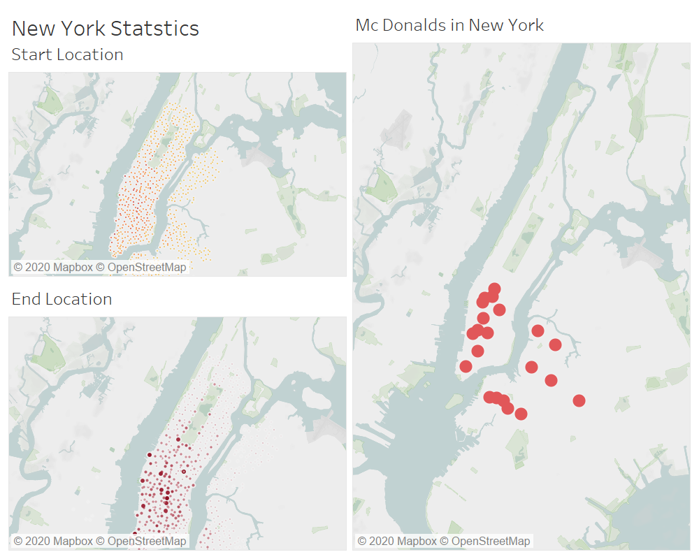
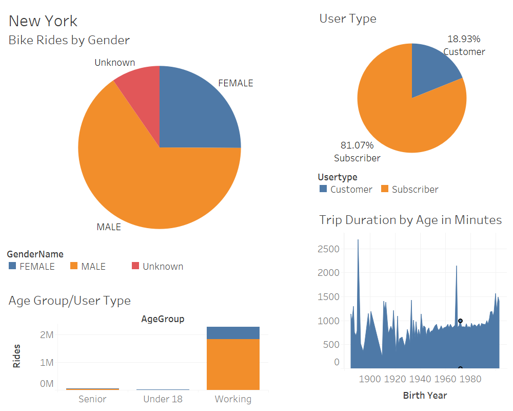
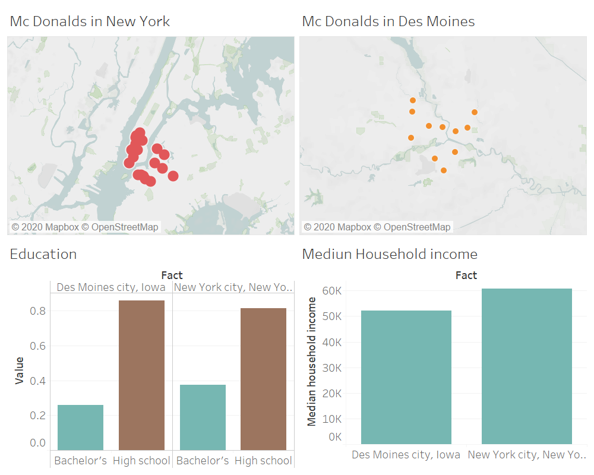
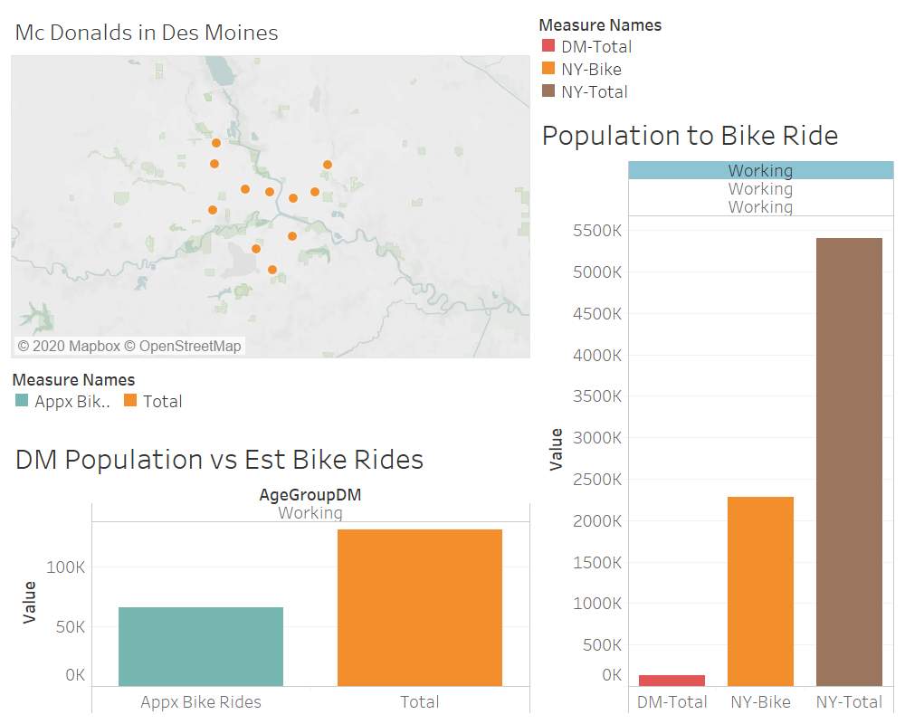

# Link for Tableau public for this analysis is

https://public.tableau.com/profile/lisa3634#!/vizhome/ChallengeCitibikeDesMoines/CitibikeinDesMoines?publish=yes

# NYC Citi Bike Analysis 

New York city is over crowded and has a lot of traffic. It is hard for the people to travel here by private car. They prefer public transportation. Public transportation is good but there will be walking involved to go to office. Hence the citibike concept is very popular in New York city. 
The commuters take subscription and use these bikes to go from the subway station to their work place. This is in high use near the dense area of downtown Manhattan. The working age group uses the bikes the most. Weekdays the use of citibike is between 6:00 am and 10:00 am which is office use and weekends in the afternoon. 
Seeing at the statistics for trip time it seems average trips are quite short. The bikes are also used by travellers for sight seeing purposes and they enjoy using this bike. 
Usually the bikers may be picking up coffee from McDonalds on their way and hence it shows concentration of bike near that. 
If we compare working age group and number of bike rides its around one out of two people use citibike once in a month. Weather could also be a factor to decide if people will take bike riding or not. 
Data also shows that overall male use more bikes then female

# Why Des Moines Citi Bike
## Question I am trying to answer are 
### What is the population of Des Moines? How does its population compare to the population of New York City? Does the population affect the number of people who will use the bike-sharing program?
### What is the density of McDonald's in New York City versus Des Moines? Does this affect where people go in the city? If so, how?

Des Moines is a large city in Iowa. There are many jobs in this city and people usually stay in suburbs and commute to Des Moines for work. There is a public bus transportation available in Des Moines. There are many visiting places near to this city.

### Favorable weather
Des Moines weather is similar to NYC. average 200+ days are sunny here and rain is much less then NYC. So overall the weather is favorable for biking. 
Data from https://www.bestplaces.net/climate/?c1=53651000&c2=51921000

### Cost of Living
The mediuen income per household for both the cities is quite similar as per census data but cost of living in Des Moines is way lower then NYC. Hence the spening power of people is much more. This leaves them with more money to spend of hobbies and biking could be one of those. Data from https://www.census.gov/quickfacts/desmoinescityiowa

### Education
As per census data the education level in NYC and Des Moines is the same and this says the people in Des Moines will be equally health concious as NYC and they will prefer using bikes. Data from https://www.census.gov/quickfacts/desmoinescityiowa

### Things to do
There are many things to do here and with favorable weather people will like to rent a bike and do the outdoor activities
link https://www.catchdesmoines.com/things-to-do/

# Des Moines Proposal

### Bike Station near Mc Donalds
We propose to open bike stations near to Mc Donalds as that is observed that people bike more around Mc Donalds in NYC

### Smaller business then NYC
The population of Des Moines is way lower then NYC and hence the expected bike rides will also be low. So we should analyse further to find what will be best number of bikes and stations proposed. This will be less investment over NYC.

### The Gender ratio
The gender ratio in NYC and Des Moines is the same and hence that will not impact the number of riders

### Duration of Rental
The duration of rental may be longer as the environment in Des Moines is more relaxed. This will make more profit

## Data used
https://www.catchdesmoines.com/things-to-do/
https://www.bestplaces.net/cost-of-living/new%20york_ny/des%20moines_ia/50000
https://data.census.gov/cedsci/table?q=New%20York%20city,%20New%20York%20Populations%20and%20People&tid=ACSST1Y2018.S0101

## Along with
https://www.census.gov/quickfacts/desmoinescityiowa
https://courses.bootcampspot.com/courses/128/files/17562
https://courses.bootcampspot.com/courses/128/files/17561
